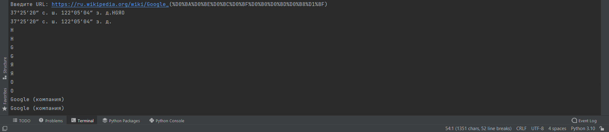
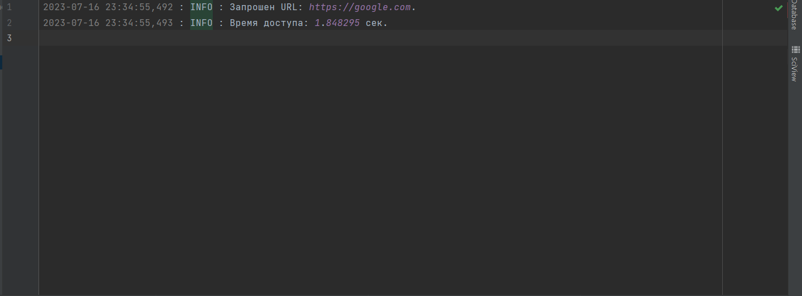

# Post_From_Link


##  Post from link

> Программа веб-скрапера позволяет получить контент веб-страницы по указанной ссылке и вывести содержимое тегов h1, h2, h3, h4, h5, h6, p и span.



**Пример программы так работает.**


## Установка

**Для запуска программы необходимо установить следующие зависимости:**

1. Установите Python (версия 3.11.4) на ваш компьютер.

2. Клонируйте репозиторий с GitHub:
    ```bash
    $  git clone git clone  https://github.com/Humoyun004/Post_From_Link.git
    ```
3. Перейдите в директорию с программой:
cd Post_From_Link

4. Установите необходимые зависимости, выполнив следующую команду: 
    ```bash
    $ pip install requests beautifulsoup4
    ```
## Использование
1. **Откройте командную строку или терминал.**

2. **Перейдите в каталог, где находится файл main.py.**

**Запустите программу с помощью следующей команды:**
```bash
$ python main.py 
```
**Программа запросит у вас ссылку. Введите ссылку и нажмите Enter. Затем программа выполнит запрос по указанной ссылке, получит содержимое страницы и выведет на экран текстовое содержимое тегов h1, h2, h3, h4, h5, h6, p и span.**
 

## Логирование
**Программа также осуществляет логирование времени доступа и возможных ошибок. Логи записываются в post_from_link.log и содержат информацию о времени доступа, URL и коде ошибки (если таковая возникла).**

## Заметки
- **Проверьте, что у вас есть соответствующие права доступа к указанной ссылке.**
- **Убедитесь, что веб-страница содержит теги h1, h2, h3, h4, h5, h6, p или span, иначе вывод будет пустым.**


## Вклад
**Если вы хотите внести свой вклад в развитие приложения "Post from link", пожалуйста, следуйте этим шагам:**

1. Форкните репозиторий на GitHub.
2. Клонируйте ваш форк репозитория на локальную машину.
3. Создайте новую ветку для вашей функции или исправления ошибки.
4. Внесите изменения и сделайте коммиты с описательными сообщениями.
5. Отправьте ваши изменения в ваш форк репозитория.
6. Создайте pull request (запрос на включение) в основной репозиторий.


## Контакты
**Если у вас есть вопросы или предложения относительно приложения "Post from link", пожалуйста, свяжитесь с нами по адресу humoyunakbaraliev1@gmail.com. Мы ценим ваше мнение!**


